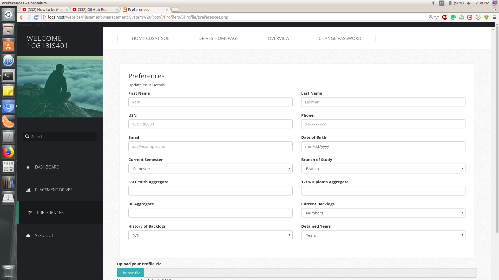
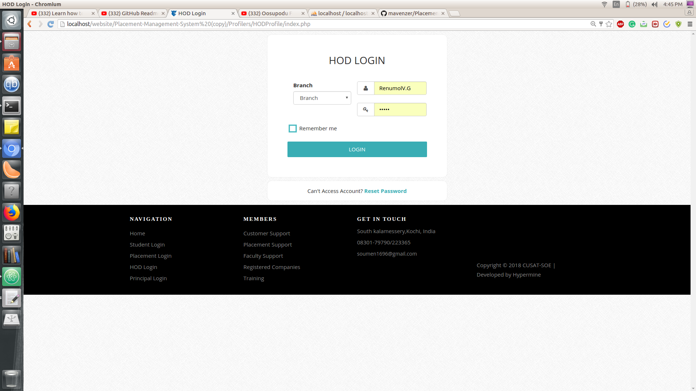
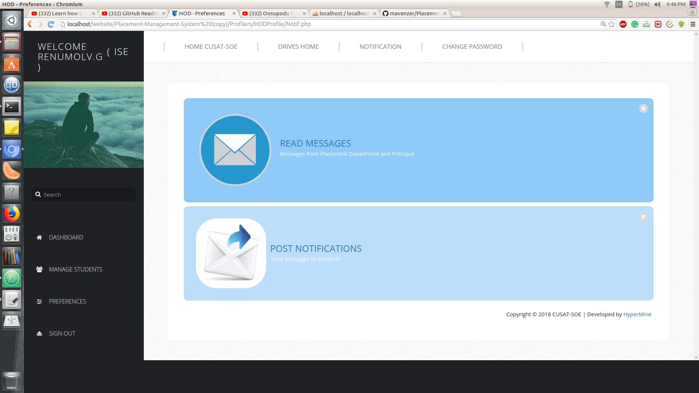
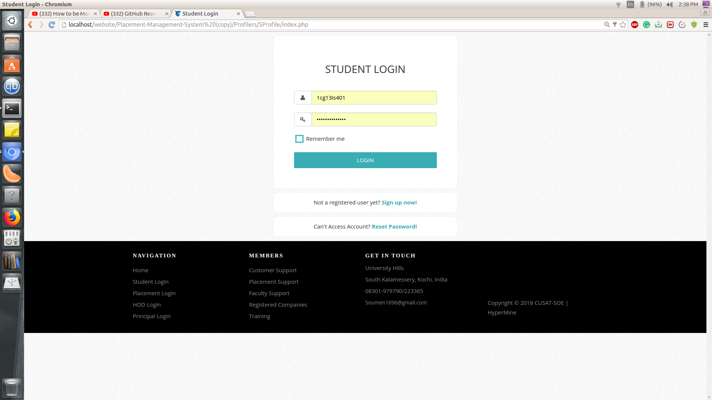
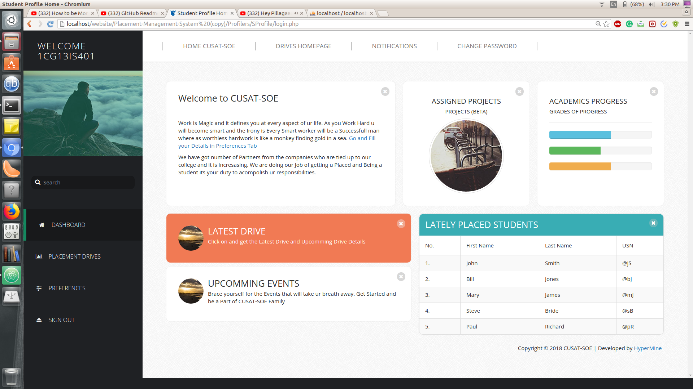
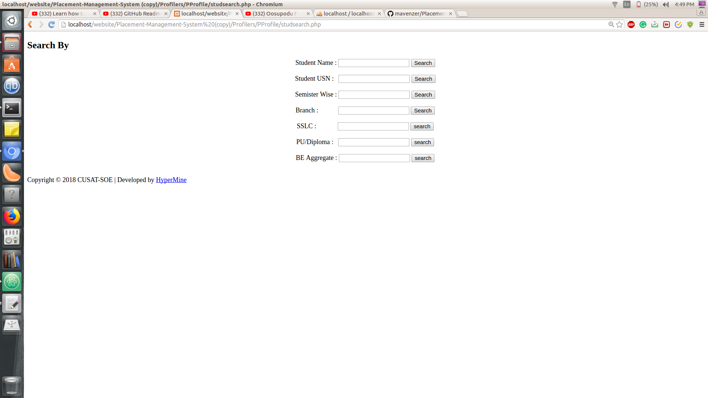
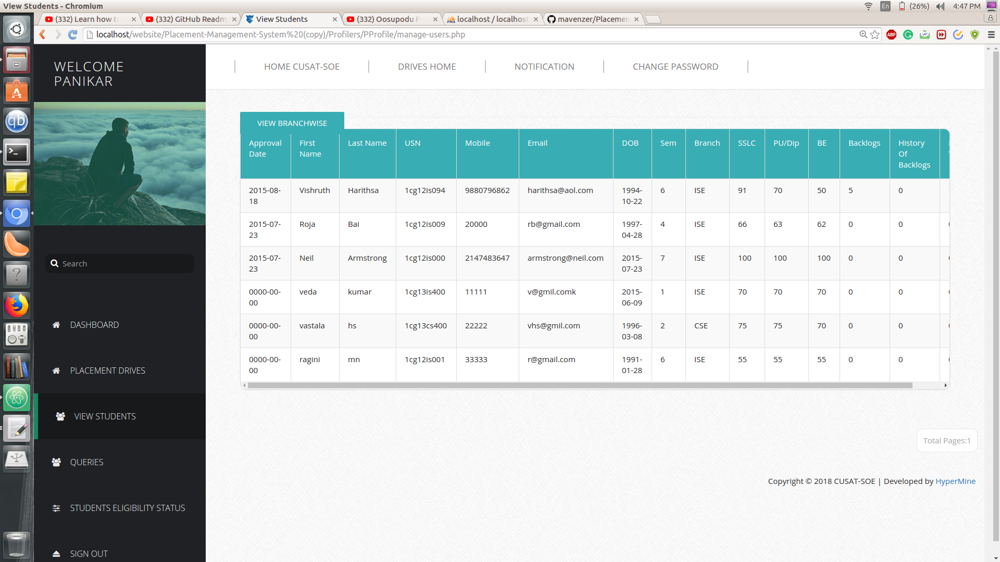
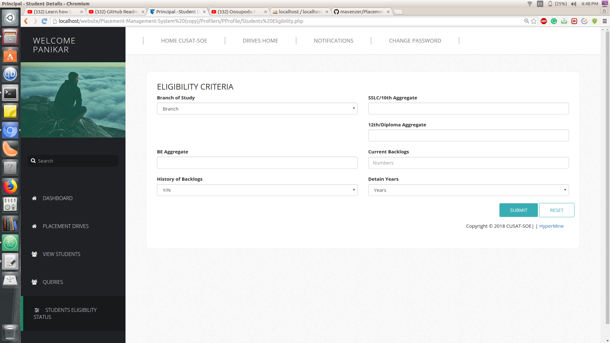

# Placement--Management--System

# Preview 

## A Smart Way to Manage the Progress of Students

## How to use this repository in your Local machine.
   Clone the code from my account and if your are using linux and lampp stack then copy the folder to the htdocs.
   Create 2 databases  using **phpmyadmim** name of  the database should be **details** and **placement** and import the code      from the Databases folder, there are two files in total on Revised.sql and Skeleton Database.sql . You can pick any of the      codes for importing into databases.

# Code is compatible with the new version version of MySql Improvised Version
# Spoiler Alert for those who want the code should be backward compatible
Most of the php  codes are written in the Object Oriented way , but if anybody want to be in procedural way can change the 
$connect = mysqli_connect("localhost", "root","", "details");
"details " is the name of the database, and there is no password in my lammp stack.But if you have replace with your own password.

# Used Technologies

## Lanuages
  1. HTML5
  2. CSS3
  3. JavaScript
  4. PHP (Backend Database Functions) version .
  5. MySQL (Database)
  6. Bootstrap
  7. Google Maps Api
  8. Jquery
  9. Ajax
  
Most of the work is copied from stackoverflow and some githubs accounts
